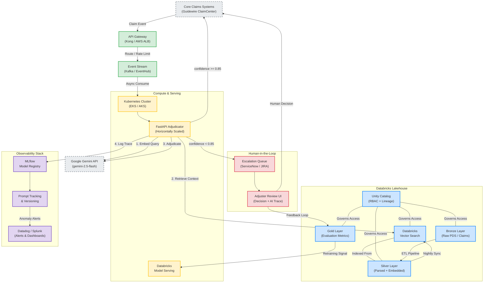

# Future State: Enterprise Architecture & Scaling Roadmap

## Executive Summary

The current GenAI Policy Adjudicator is a **Phase 1 Proof of Concept** — a fully containerized, locally executable microservice that demonstrates the end-to-end RAG adjudication pipeline. It validates the core hypothesis: that an LLM, grounded by retrieved policy context and constrained to structured output, can reliably triage insurance claims.

This document outlines the trajectory from this POC to a **Tier-1, highly available enterprise microservice** embedded directly into core claims systems. The roadmap is designed for incremental rollout with zero-downtime deployment, strict regulatory compliance, and measurable business value at every phase.

---

## Target-State Enterprise Architecture

---

## Step-by-Step Production Roadmap

### Phase 1: Pilot & Shadow Mode — Months 1–2

**Objective:** Validate AI accuracy against human decisions without operational risk.

| Action | Detail |
|---|---|
| **Deploy in Shadow Mode** | Deploy the Dockerized API alongside the legacy claims system. The AI evaluates every claim in real-time, but its decisions are **logged only** — never acted upon. |
| **Establish Accuracy Baseline** | Compare AI decisions against actual human adjuster outcomes. Track agreement rate, false positive/negative rates, and average confidence scores. |
| **Instrument MLflow** | All shadow-mode evaluations flow through the existing MLflow tracking pipeline. Use the Gold layer to aggregate accuracy metrics by claim type, dollar value, and policy vintage. |
| **Success Criteria** | AI-human agreement rate ≥ 90% on Tier 1 claims (low complexity, < $5,000). |

### Phase 2: Databricks Migration & RAG Scaling — Months 3–4

**Objective:** Replace local infrastructure with enterprise-grade, scalable data services.

| Action | Detail |
|---|---|
| **Migrate Vector Store** | Swap `ChromaVectorStore` for a `DatabricksVectorStore` implementation using the existing `VectorStore` ABC. This is a single-class swap — no pipeline changes required. |
| **Automated ETL Pipelines** | Build nightly Databricks Jobs that ingest updated PDS documents from the Bronze layer, parse and chunk them into the Silver layer, and sync embeddings to Vector Search. |
| **Unity Catalog Integration** | Register all data assets (raw PDS, embeddings, evaluation metrics) under Unity Catalog for column-level access control and full data lineage. |
| **Success Criteria** | Vector Search latency < 200ms at p95. Zero manual data refresh steps. |

### Phase 3: Low-Risk Automation (STP) — Months 5–6

**Objective:** Enable Straight-Through Processing for high-confidence, low-risk claims.

| Action | Detail |
|---|---|
| **Enable STP for Tier 1** | Claims with AI confidence ≥ 0.95 **and** claim value < $5,000 are auto-approved without human review. All others are routed to the HITL escalation queue. |
| **HITL Escalation Queue** | Integrate with ServiceNow / JIRA to create work items for human adjusters. The work item includes the full AI decision trace (prompt, cited clause, reasoning). |
| **Feedback Loop** | Human adjuster overrides are fed back into the Gold evaluation layer. Monthly model performance reports are auto-generated. |
| **Success Criteria** | 40%+ of Tier 1 claims processed via STP. Human override rate < 5%. |

### Phase 4: Ecosystem Integration — Months 7+

**Objective:** Embed the AI decision engine into the adjuster workflow and expand capabilities.

| Action | Detail |
|---|---|
| **Adjuster UI Integration** | Embed the AI decision trace directly into the Guidewire ClaimCenter UI. Adjusters see the AI recommendation, cited policy clause, and confidence score alongside their existing workflow. |
| **Multi-Agent Expansion** | Add specialized agents for fraud detection (anomaly scoring on claim patterns) and multimodal input processing (damage photos, telematics data). |
| **Model Serving Migration** | Migrate from direct Gemini API calls to Databricks Model Serving endpoints for centralized governance, A/B testing, and model versioning. |
| **Success Criteria** | End-to-end claim triage time reduced by 60% vs. manual baseline. |

---

## Security & Compliance Guardrails

### PII Scrubbing

All claim data must be sanitized **before** transmission to external LLM APIs. The recommended approach:

1.  **Microsoft Presidio** (or equivalent NER-based scrubber) runs as a pre-processing step in the FastAPI middleware.
2.  PII entities (names, addresses, policy numbers) are replaced with deterministic tokens (e.g., `[POLICYHOLDER_1]`).
3.  After adjudication, tokens are re-hydrated in the response before returning to the core system.

This ensures that **no raw PII leaves the organization's network boundary**.

### Role-Based Access Control (RBAC)

| Role | Permissions |
|---|---|
| **Claims Adjuster** | View AI decisions in the HITL queue. Override or confirm decisions. |
| **Claims Manager** | All adjuster permissions + view aggregate accuracy dashboards and STP metrics. |
| **Data Engineer** | Manage ETL pipelines, vector store refresh, and Unity Catalog assets. No access to claim PII. |
| **ML Engineer** | Access MLflow model registry, prompt versioning, and evaluation notebooks. No direct claim access. |
| **Auditor (Read-Only)** | Read-only access to WORM decision logs. Cannot modify or delete any records. |

Access is enforced via **Unity Catalog** for data assets and **Identity Provider (Okta/Azure AD)** for application-layer roles.

### Immutable Audit Trail (WORM Storage)

Every AI decision trace must be stored in a **Write-Once-Read-Many (WORM)** compliant format:

-   **What is logged:** The full prompt, retrieved policy chunks, model response, confidence score, and final decision.
-   **Storage:** Decision JSON artifacts are written to an append-only storage layer (e.g., AWS S3 Object Lock, Azure Immutable Blob Storage).
-   **Retention:** Minimum 7-year retention period, aligned with financial services regulatory requirements (APRA CPS 234, ASIC RG 267).
-   **Access:** Only the Auditor role can query these records. No role can modify or delete them.

This satisfies internal and external audit requirements by providing a tamper-proof, chronologically ordered record of every automated decision the system has ever made.
