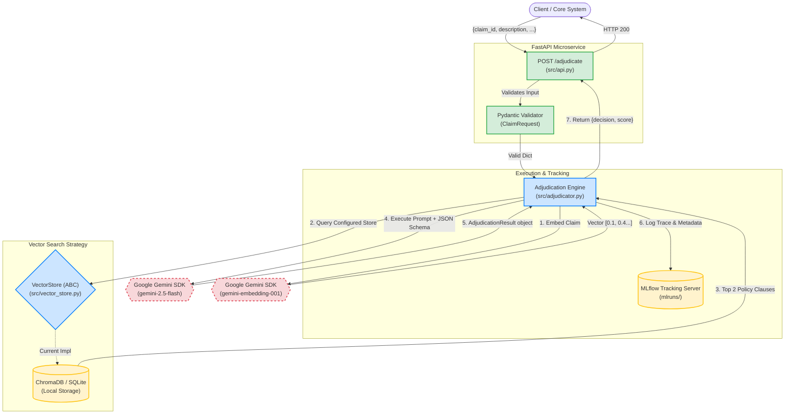

# Architecture Documentation: Final

## Overview
The **GenAI Policy Adjudicator** is a robust, production-ready microservice built in Python. The system processes raw, unstructured claim dictionaries, searches a Vector DB for relevant insurance policy clauses, and orchestrates an LLM to automatically decision the claim.

## Architecture Diagram

## Core Components
1. **API Layer (`src/api.py`)** -> Designed using FastApi to sit effectively behind enterprise Firewalls or load balancers.
2. **Instrumentation Layer (`src/adjudicator.py` + MLflow)** -> All claim evaluations, prompts, inference arguments, and model signatures are immutably tracked in MLflow for governance and continuous refinement. 
3. **Reasoning Layer (`src/adjudicator.py`)** -> An execution pipeline that takes chunks from a Vector DB and injects them alongside a Pydantic Schema model to enforce that the LLM (`gemini-2.5-flash`) only returns pure, structured JSON arrays containing the decision, confidence score, cited policy extraction string, and reasoning.
4. **Knowledge Store (`src/vector_store.py`)** -> Leverages Google's `gemini-embedding-001` to vectorize text logic. It uses the `VectorStore` Abstract Base Class, currently implementing the `ChromaVectorStore` concrete class for portability, but acts as a seam to swap in a scalable datastore (e.g. Databricks Vector Search or generic SQL via `pgvector`) in less than 20 lines of code.

## Cloud Target & Extension
* **Cloud Deployment:** This service evaluates perfectly inside a container. The `uvicorn` entry point can be effortlessly mounted to GCP Cloud Run or Azure Container Apps in a completely serverless manner.
* **Continuous Integration:** Using `FastAPI.testclient` allows the CI pipeline to perfectly simulate incoming application load without needing real compute loops, running on GitHub Linux VMs natively.

